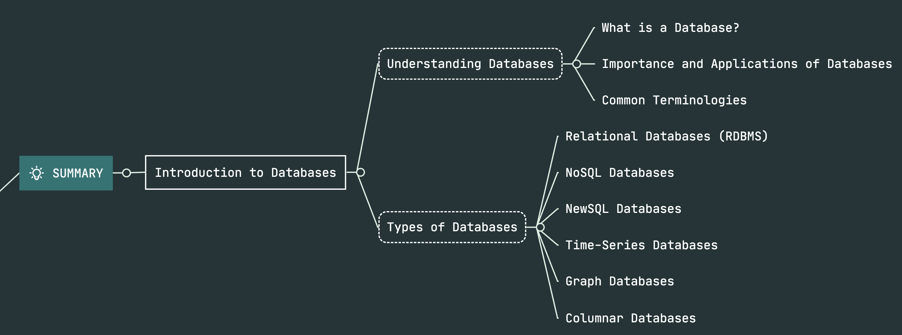
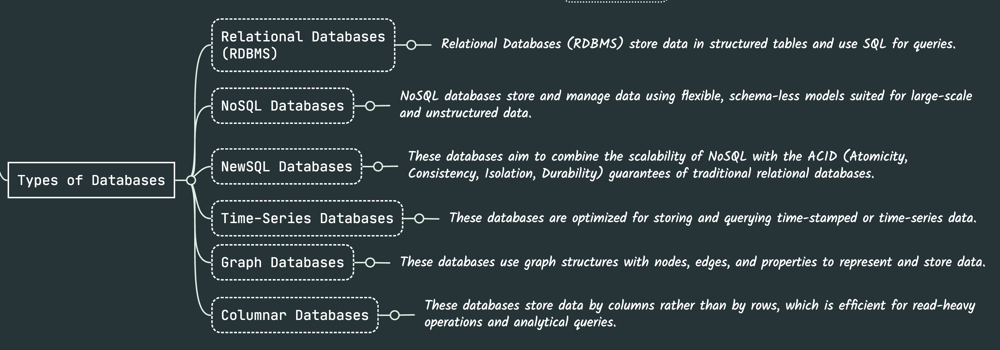

# DAY-1 Topics List

### 1. Introduction to Databases

#### Understanding Databases:

**What is a Database?**

A database is an organized collection of data, generally stored and accessed electronically from a computer system. Databases are designed to store, retrieve, and manage large amounts of information efficiently and securely.

**Importance and Applications of Databases:**

- **Data Management:** Databases help in managing and organizing data systematically.
- **Quick Access:** They allow quick retrieval and updating of data.
- **Data Integrity:** Databases ensure the accuracy and consistency of data over its lifecycle.
- **Security:** They provide secure data storage and access controls.
- **Applications:** Used in various fields like banking (transaction records), social media (user profiles), healthcare (patient records), e-commerce (product catalogs), and more.

**Common Terminologies:**

- **Tables:** These are the structures within a database that store data. Think of them as similar to spreadsheets in Excel, where data is organized in rows and columns.
  
  Example: A `Users` table might store information like `UserID`, `Name`, and `Email`.

- **Rows:** Each row represents a single record in a table.
  
  Example: In the `Users` table, a row might contain the data for one user, such as `1, John Doe, john@example.com`.

- **Columns:** Each column represents a specific attribute of the data.
  
  Example: In the `Users` table, columns could be `UserID`, `Name`, and `Email`.

- **Keys:**
  - **Primary Key:** A unique identifier for each record in a table.
    
    Example: `UserID` in the `Users` table can be the primary key.
  - **Foreign Key:** A field in one table that links to the primary key in another table.
    
    Example: An `Orders` table might have a `UserID` as a foreign key linking to the `Users` table.

#### Types of Databases:

**Relational Databases (RDBMS):**

These databases store data in tables and use Structured Query Language (SQL) for managing and querying data. They enforce data integrity and relationships between tables.

- **Examples:** MySQL, PostgreSQL, Oracle.
  
  Example: In a library database, one table stores `Books` and another stores `Authors`. A relationship can be established between the two tables to link books to their authors.

**NoSQL Databases:**

These databases are designed for specific data models and have flexible schemas for building modern applications. They handle unstructured and semi-structured data very well.

- **Examples:** MongoDB (document-oriented), Cassandra (wide column store), Redis (key-value store).
  
  Example: A social media platform uses MongoDB to store user profiles with different fields for each user.

**NewSQL Databases:**

These databases aim to combine the scalability of NoSQL with the ACID (Atomicity, Consistency, Isolation, Durability) guarantees of traditional relational databases.

- **Examples:** CockroachDB, Google Spanner.
  
  Example: A financial application requires the scalability of NoSQL but also needs to ensure transactions are reliable and consistent, so it uses Google Spanner.

**Time-Series Databases:**

These databases are optimized for storing and querying time-stamped or time-series data.

- **Examples:** InfluxDB, TimescaleDB.
  
  Example: An IoT application uses InfluxDB to store sensor data with timestamps, such as temperature readings over time.

**Graph Databases:**

These databases use graph structures with nodes, edges, and properties to represent and store data. They are excellent for handling complex relationships.

- **Examples:** Neo4j, Amazon Neptune.
  
  Example: A recommendation system uses Neo4j to store and analyze connections between users and products.

**Columnar Databases:**

These databases store data by columns rather than by rows, which is efficient for read-heavy operations and analytical queries.

- **Examples:** Apache HBase, Google Bigtable.
  
  Example: A big data analytics platform uses Google Bigtable to quickly aggregate and analyze vast amounts of data, such as user behavior logs.

By understanding these concepts and examples, you can see how databases are fundamental to managing data efficiently and how different types of databases serve different needs based on their specific use cases and strengths.